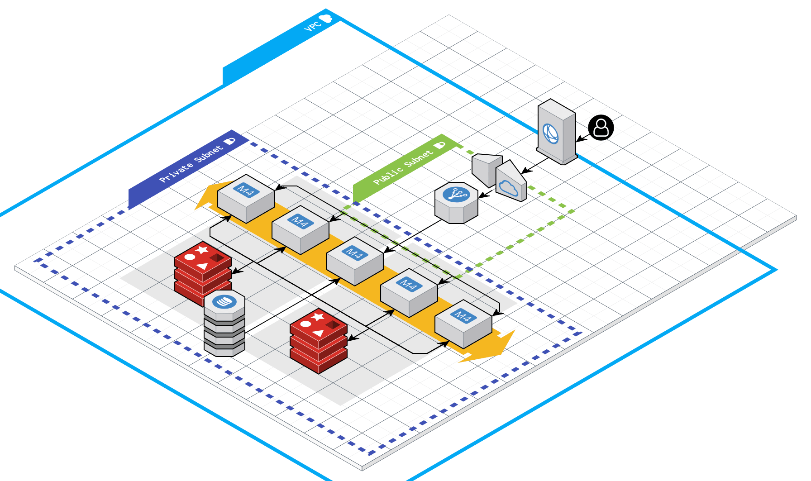
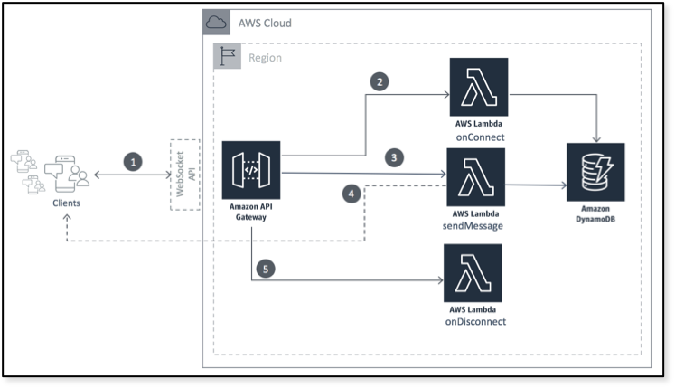

# Rplace

- [1. Architecture](#1-architecture)
  - [1.1. Diagram](#11-diagram)
  - [1.2. Components](#12-components)
    - [1.2.1. Cloudfront](#121-cloudfront)
    - [1.2.2. Internet Gateway](#122-internet-gateway)
    - [1.2.3. ELB and Fargate](#123-elb-and-fargate)
    - [1.2.4. Redis](#124-redis)
    - [1.2.5. DynamoDB](#125-dynamodb)
  - [1.3. Explanation](#13-explanation)
    - [1.3.1. Websockets](#131-websockets)
    - [1.3.2. GETs](#132-gets)
    - [1.3.3. PUTs](#133-puts)
  - [1.4. Comparison with AWS WebSocket API on API Gateway](#14-comparison-with-aws-websocket-api-on-api-gateway)

# 1. Architecture
## 1.1. Diagram

## 1.2. Components
### 1.2.1. Cloudfront
Cloudfront is used for caching the board when it is requested by the user. The TTL (time to live) of data on cloudfront is 3 seconds, meaning every 3 seconds the cached version of the board will update. The purpose of this was to reduce the load on our Redis Elasticache servers.
### 1.2.2. Internet Gateway
Internet gateway is a horizontally scaled, redundant, and highly available VPC component that allows communication between our VPC and the internet. It prevents users from accessing the other components of our VPC directly, and is placed in a public subnet.
### 1.2.3. ELB and Fargate
Fargate is Amazon's fully managed Docker image deployment service. It scales from 0 to infinite horizontally automatically based on parameters that we have provided (CPU and RAM usage). ELB or Elastic Load Balancer is sued to load balance all incoming requests across the cluster of containers running on Fargate. Fargate is deployed across two AZs (availability zones) in us-east1. The Fargate containers will be used to keep active websocket connections in memory and update Redis when a PUT is made, or query Redis when a GET request is received.
### 1.2.4. Redis
Redis is used to cache the board as a bitfield and as a Pubsub service, where each container in the Fargate cluster will listen for updates to the board and broadcast said update to its' clients.
### 1.2.5. DynamoDB
DynamoDB is used for persistent storage of the board and tracking changes over time. Every PUT request is stored with a corresponding timestamp.
## 1.3. Explanation
### 1.3.1. Websockets

When a user opens the the website, their browser will initiate a websocket connection with our backend. This connection request is loadbalanced across one of our running Fargate containers, which will initiate the websocket connection, and store the resulting data in memory. This websocket connection is a one-way connection, it only allows for data to be sent from Fargate to the user when there is an update to the board.

As a container connects to more and more clients, it will increase it's CPU and RAM usage. When a container reaches 70% RAM usage, the Fargate cluster will automatically scale up and spin up a new container, and new connections will be load balanced to the new container. When a container has no active connections, Fargate will remove it from the cluster and scale down. At idle, the system has 0 running containers.

In this way we ensure:
1. Scaling to zero
2. Scaling to infinite
3. Fast websocket updates.

### 1.3.2. GETs

When a GET request for the board is made, it will first go through Cloudfront, where the board is cached at the CDN level. If there is a cache hit, then Cloudfront simply responds with the resulting data. If not, then the request will be load balanced across the running containers in our Fargate cluster. Fargate will then query Redis, where a bitfield representing the board is stored. Finally, the Fargate container will respond with the resulting data. This data is sent to Cloudfront, which caches it and responds to the client.

### 1.3.3. PUTs

When the client clicks on a pixel in the board, their browser will send a PUT request to our backend. This PUT request will be loadbalanced across our Fargate cluster. When a Fargate container receives the request it will: 

1. Send a notification in a Redis Pubsub channel notifying all connected Fargate containers that there was a PUT request.
2. Update the bitfield in Redis.

When there is an update in the Redis Pubsub channel, all subscribed containers will update their corresponding clients through their stored websocket connections.

## 1.4. Comparison with AWS WebSocket API on API Gateway

AWS provides a similar implementation of scalable websockets through API Gateway using WebSocket API. Below is a diagram of this system:

In this system, whenever there is a new client connection, the connection data is stored in DynamoDB. Then, when a new pixel is drawn on the board, another Lambda will be ran to query the active connections from DynamoDB and send each an update.

One benefit of this system over ours is the use of Lambdas as compute instead of Fargate, as Lambdas can scale up/down faster. However, the biggest issue with this system, and the reason why we decided not to use it, is that each connection will be stored in disk in DynamoDB instead of in memory (as is the case in our Fargate cluster). This means that for every pixel drawn, we would need to query DynamoDB. As we designed our system for ~300k users, or ~60k PUT requests a minute, this means that we will quickly either overload DynamoDB or accrue very high costs.
